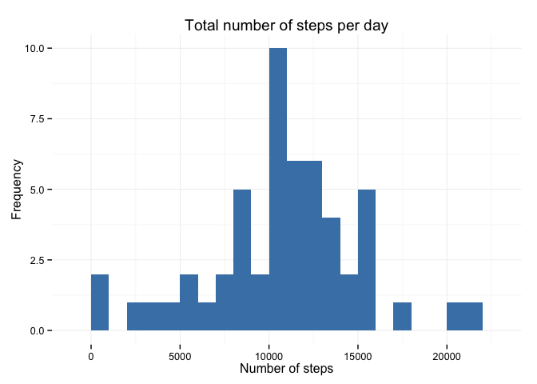
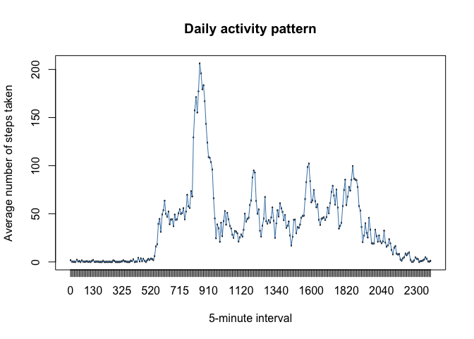
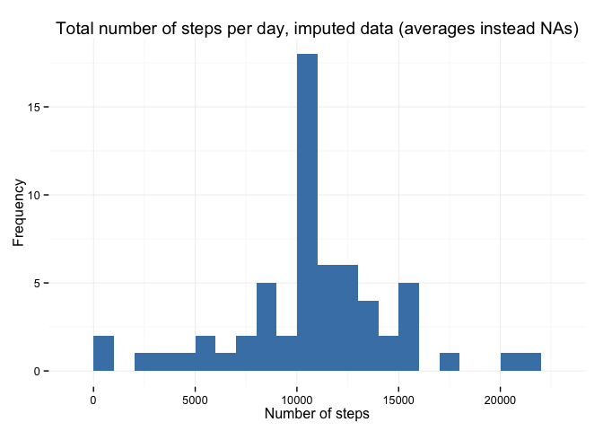
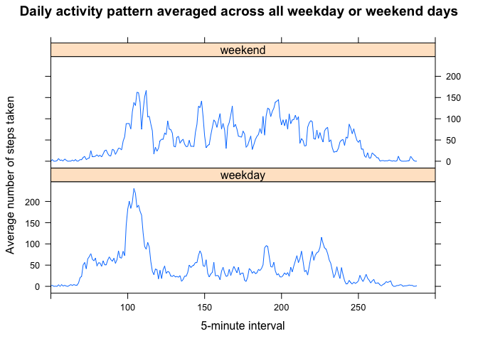

# Reproducible Research: Peer Assessment 1


  
## 1. Loading and preprocessing the data  
  
1.1. Prepare the environment, load packages

```r
library(knitr)
library(ggplot2)
library(dplyr)
```

```
## 
## Attaching package: 'dplyr'
```

```
## The following objects are masked from 'package:stats':
## 
##     filter, lag
```

```
## The following objects are masked from 'package:base':
## 
##     intersect, setdiff, setequal, union
```

```r
library(lattice)
```

1.2. Set working directory
1.3. Unzip the file
1.4. Read CSV
1.5. Preprocess data (change classes to _factor_ for the _interval_ variable and to _date_ for the _date_ variable)

```r
setwd("~/RepData_PeerAssessment1") 

if(!file.exists("activity.csv")) {
        unzip("activity.zip")
}

activity <- read.csv(file = "activity.csv", stringsAsFactors = FALSE)

activity$interval <- as.factor(activity$interval)
activity$date <- as.Date(activity$date)
```


1.6. Looking at the file structure and verifying correctness of classes of variables

```r
str(activity)
```

```
## 'data.frame':	17568 obs. of  3 variables:
##  $ steps   : int  NA NA NA NA NA NA NA NA NA NA ...
##  $ date    : Date, format: "2012-10-01" "2012-10-01" ...
##  $ interval: Factor w/ 288 levels "0","5","10","15",..: 1 2 3 4 5 6 7 8 9 10 ...
```

1.7. Looking at the first rows of the CSV file

```r
head(activity)
```

  steps       date interval
1    NA 2012-10-01        0
2    NA 2012-10-01        5
3    NA 2012-10-01       10
4    NA 2012-10-01       15
5    NA 2012-10-01       20
6    NA 2012-10-01       25

The file consists of three columns:  
• STEPS, class = integer. Number of steps taking in a 5-minute interval (missing values are coded as NA)    
• DATE, class = date. The date on which the measurement was taken in YYYY-MM  -DD format  
• INTERVAL, class = factor. Identifier for the 5-minute interval in which measurement was taken.    
  

## 2. What is mean total number of steps taken per day?  
  
2.1. Create a table with the number of steps per day

```r
daily <-
  aggregate(formula = steps~date, data = activity,
            FUN = sum, na.rm=TRUE)
```

2.2. Make a histogram of the total number of steps taken each day

```r
ggplot(daily,aes(x = steps)) +
        ggtitle("Total number of steps per day") +
        xlab("Number of steps") +
        ylab("Frequency") +
        geom_histogram(fill = "steelblue", binwidth = 1000) +
        theme_minimal() 
```

\


2.3. Calculate and report the mean and median of the total number of steps taken per day  


```r
round(mean(x=daily$steps), 0)
```

```
## [1] 10766
```


```r
median(x = daily$steps)
```

```
## [1] 10765
```

The **mean** and **median** of the total number of steps taken per day are **10766** (rounded) and **10765**, accordingly.  
  

## 3. What is the average daily activity pattern?  
  
3.1. Make a time series plot (i.e. 𝚝𝚢𝚙𝚎 = "𝚕") of the 5-minute interval (x-axis) and the average number of steps taken, averaged across all days (y-axis)

```r
stepsInterval <- aggregate(steps ~ interval, data = activity, mean, na.rm = TRUE)
plot(steps ~ interval, data = stepsInterval, 
        type = "l", main = "Daily activity pattern", 
        xlab = "5-minute interval", ylab = "Average number of steps taken")
lines(stepsInterval$interval, stepsInterval$steps, type = "l", col = "steelblue", lwd = 1)
```

\


  
3.2. Get the data for the interval with the most average activity across the days

```r
mostAverageActivity <- stepsInterval[which(stepsInterval$steps==max(stepsInterval$steps)),]
mostAverageActivity
```

```
##     interval    steps
## 104      835 206.1698
```
  
The 5-minute interval **835** contains the maximum number of steps, **206.1698**.  

## 4. Imputing missing values  
  
The presence of missing days may introduce bias into some calculations or summaries of the data.  

4.1. Calculate and report the total number of missing values in the dataset (i.e. the total number of rows with 𝙽𝙰s  ).
  
Sum of missing values in total and in by each column:

```r
sum(is.na(activity))
```

```
## [1] 2304
```

```r
sum(is.na(activity$steps))
```

```
## [1] 2304
```

```r
sum(is.na(activity$date))
```

```
## [1] 0
```

```r
sum(is.na(activity$interval))
```

```
## [1] 0
```
The data table contains **2304** rows with missing values. All of the missing values are missing number of steps and none in date and interval. 

4.2. Devise a strategy for filling in all of the missing values in the dataset. The strategy does not need to be sophisticated. For example, you could use the mean/median for that day, or the mean for that 5-minute interval, etc.

```r
impActivity <- merge(x = activity, y = stepsInterval, by = "interval", all.x = TRUE)
impActivity[is.na(impActivity$steps.x),c("steps.x")] <- impActivity[is.na(impActivity$steps.x),c("steps.y")]
impActivity$date <- as.Date(impActivity$date)
impActivity$date.x <- NULL
impActivity$Group.1 <- NULL
impActivity$steps <- impActivity$steps.x
impActivity$steps.x <- NULL
impActivity$steps.y <- NULL
```

4.3 Create a new dataset that is equal to the original dataset but with the missing data filled in.

```r
newDaily <- aggregate(x = impActivity$steps , by = list(impActivity$date), FUN = sum ,na.rm=TRUE)
names(newDaily) <- c("date","steps")
```
  
4.4. Make a histogram of the total number of steps taken each day and Calculate and report the mean and median total number of steps taken per day. Do these values differ from the estimates from the first part of the assignment? What is the impact of imputing missing data on the estimates of the total daily number of steps?

```r
ggplot(newDaily,aes(x = steps)) +
        ggtitle("Total number of steps per day, imputed data (averages instead NAs)") +
        xlab("Number of steps") +
        ylab("Frequency") +
        geom_histogram(fill="steelblue", binwidth = 1000) +
        theme_minimal() 
```

\


```r
round(mean(x=newDaily$steps), 0)
```

```
## [1] 10766
```


```r
round(median(x = newDaily$steps), 0)
```

```
## [1] 10766
```

The original mean with missing values and the mean of the dataset with imputed data are identical. 
The original median and the median of the dataset with imputed values differ by 1%. 
It means that the original dataset with missing values would not introduce any bias in calculations of summaries.   
  

## 5. Are there differences in activity patterns between weekdays and weekends?  
  
5.1. Create a new factor variable in the dataset with two levels – “weekday” and “weekend” indicating whether a given date is a weekday or weekend day.  


```r
impActivity$day <- "weekday"
impActivity$day[weekdays(as.Date(impActivity$date), abb=T) %in% c("Sat","Sun")] <- "weekend"
table(impActivity$day)
```

```
## 
## weekday weekend 
##   12960    4608
```
  
5.2. Make a panel plot containing a time series plot (i.e. 𝚝𝚢𝚙𝚎 = "𝚕") of the 5-minute interval (x-axis) and the average number of steps taken, averaged across all weekday days or weekend days (y-axis). See the README file in the GitHub repository to see an example of what this plot should look like using simulated data.  

```r
stepsIntervalDays <- aggregate(steps ~ interval + day, data=impActivity, mean, na.rm = TRUE, na.action = NULL)
xyplot(steps ~ interval | stepsIntervalDays$day, data = stepsIntervalDays, 
       layout=c(1,2),
       type="l",
       main="Daily activity pattern averaged across all weekday or weekend days",
       ylab="Average number of steps taken", 
       xlab="5-minute interval", scales = list(x = list(tick.number=5, limits = c(50,300))
)
)
```

\
 
 
